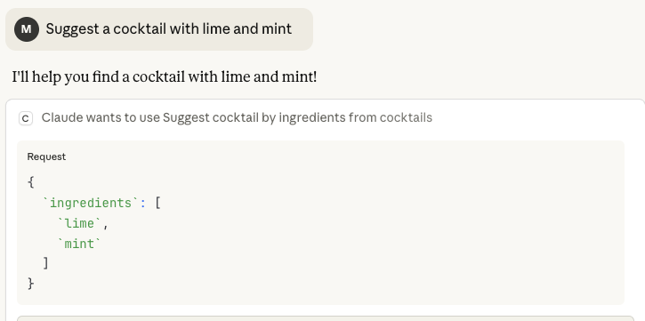
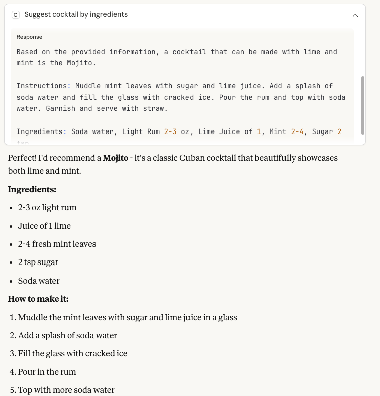

# Cocktails RAG MCP Server

MCP tool for cocktail recommendations using RAG (Retrieval-Augmented Generation).

## Requirements

- **Python 3.11+**
- **uv package manager** - https://docs.astral.sh/uv/getting-started/installation/

## Quick Start

1. **Get Groq API key** (free): https://console.groq.com/keys

2. **Setup:**

   ```bash
   # Copy environment template
   cp .env.example .env

   # Edit .env and add your GROQ_API_KEY
   nano .env

   # Install dependencies
   uv sync
   ```

3. **Pre-download models (required):**

   Download embeddings and reranker models:

   ```bash
   uv run python -c "from src.rag.rag import RAG; RAG(); print('Models downloaed!')"
   ```

4. **Install for Claude Desktop:**

   ### Automatic (Recommended)

   ```bash
   uv run fastmcp install claude-desktop fastmcp.json --name cocktails --env-file .env
   ```

   ### Manual

   Edit config file:

   - macOS: `~/Library/Application Support/Claude/claude_desktop_config.json`
   - Windows: `%APPDATA%\Claude\claude_desktop_config.json`

   ```json
   {
   	"mcpServers": {
   		"cocktails": {
   			"command": "uv",
   			"args": [
   				"run",
   				"--with","faiss-cpu",
   				"--with","fastmcp",
   				"--with","jq",
   				"--with","langchain",
   				"--with","langchain-community",
   				"--with","langchain-groq",
   				"--with","langchain-huggingface",
   				"--with","pandas",
   				"--with","python-dotenv",
   				"--with","sentence-transformers",
   				"fastmcp",
   				"run",
   				"/ABSOLUTE/PATH/TO/src/mcp/server.py:mcp"
   			],
   			"env": {
   				"GROQ_API_KEY": "your_groq_api_key_here"
   			}
   		}
   	}
   }
   ```

   Replace `/ABSOLUTE/PATH/TO/` with your project path and add your API key.

## Example Usage

<p align="center">
  
</p>

<p align="center">
  
</p>

## Local Testing

```bash
# Test RAG pipeline directly
uv run python -m src.rag.rag

# Test MCP server locally
uv run python src/mcp/server.py
```

## Development

### Code Formatting

```bash
# Format code with black
uv tool run black .

# Sort imports with isort
uv tool run isort .
```

## Project Structure

```
RAG/
├── src/
│   ├── mcp/         # MCP server implementation (FastMCP)
│   ├── rag/         # RAG pipeline (retrieve, rerank, generate)
│   ├── db/          # FAISS vector database handler
│   └── data/        # Data loading utilities
├── data/            # Cocktail dataset
├── faiss_index/     # Generated FAISS index (auto-created on first run)
├── notebooks/       # EDA notebook
├── fastmcp.json     # FastMCP configuration
├── pyproject.toml   # Project dependencies
└── .env.example     # Environment template
```

## Tech Stack

- **MCP Framework:** FastMCP
- **RAG Framework:** LangChain
- **Embeddings:** BAAI/bge-m3 (local via HuggingFace)
- **Vector DB:** FAISS (local)
- **Reranker:** BAAI/bge-reranker-v2-m3 (local via HuggingFace)
- **LLM:** Groq API (llama-3.1-8b-instant)
- **Package Manager:** uv
